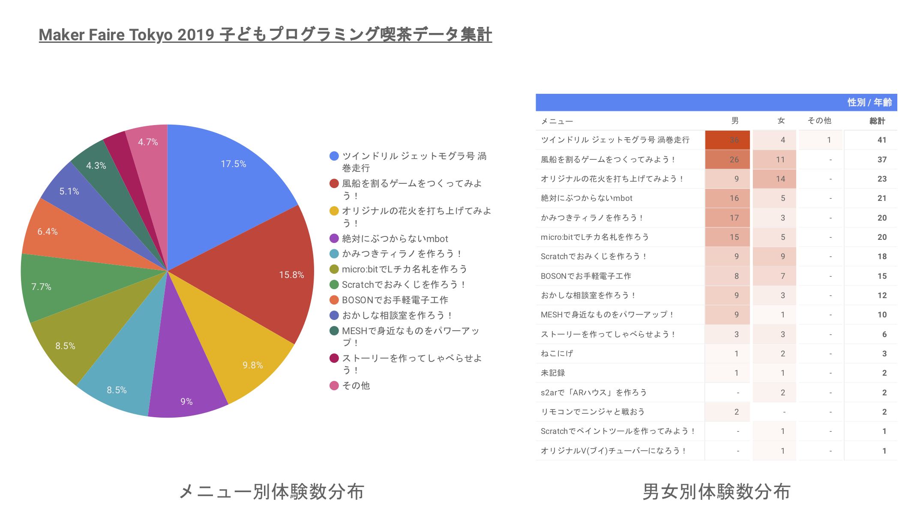
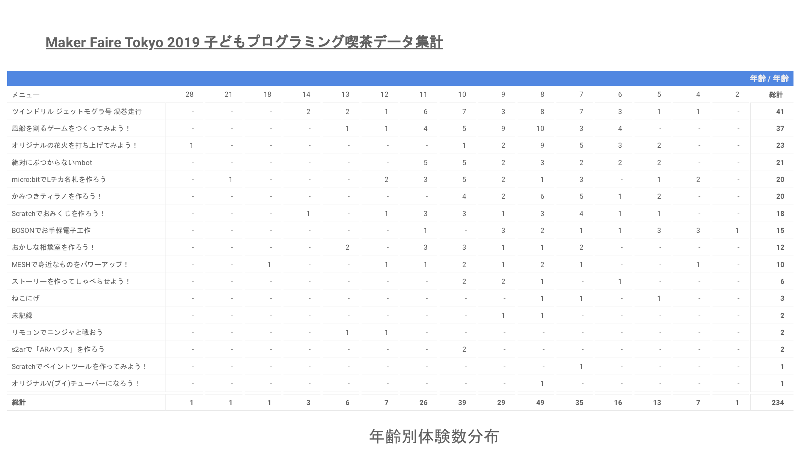

# Maker Faire Tokyo 2019 子どもプログラミング喫茶集計データ
こちらのページでは、Maker Faire Tokyo 2019で開催された「子どもプログラミング喫茶」のにおける、メニュー別体験者数の集計、各メニュー体験者の性別分布、年齢分布を公開しています。

## 画像版

## PDF版
上記画像データのPDF版を[こちら](tokyo2019_summary_report.pdf)から参照できます。

## csv形式データ
上記以外の分析を行う場合は、[csv形式の集計元データ](data.csv)をご利用ください。
